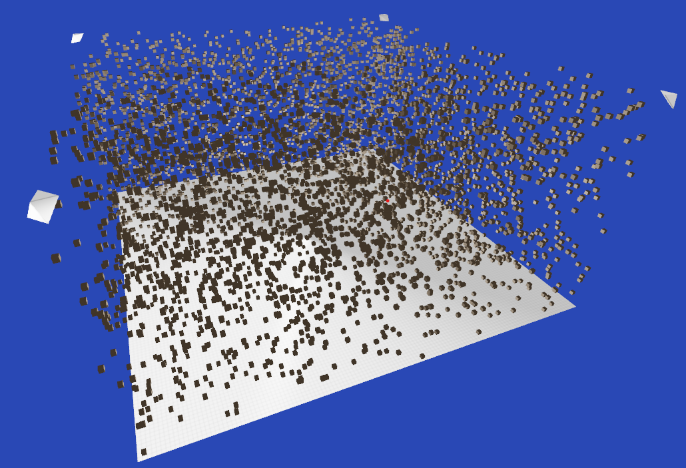

# Computer Vision 3D Reconstruction
Python OpenGL 3.3



## Installation
Tested with Python 3.9.0. You can see all the libraries and versions in requirements.txt.

Install following packages via pip:
1. PyOpenGL: `pip install PyOpenGL PyOpenGL_accelerate`
2. GLFW: `pip install glfw`
3. PyGLM: `pip install PyGLM`
4. numpy: `pip install numpy`
5. Pillow: `pip install Pillow`

If you have errors after installation you will do following:
1. `pip uninstall PyOpenGL PyOpenGL_accelerate`
2. Download and install PyOpenGL and PyOpenGL_accelerate from https://www.lfd.uci.edu/~gohlke/pythonlibs/

## Control
```
G - to visualize new voxel array
ESC - to exit the program
```

## Execution
Open your terminal or CMD and call `python executable.py` or `python3 executable.py`

## Thanks
- stanfortonski - https://github.com/stanfortonski - for providing such a great codebase.
